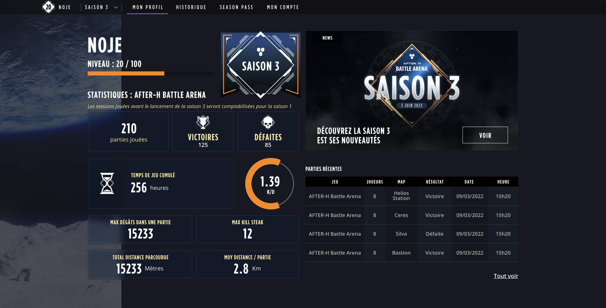

# Front end developer recruitment test

- [Front end developer recruitment test](#front-end-developer-recruitment-test)
	- [Introduction](#introduction)
	- [Features implementation](#features-implementation)
		- [API](#api)
	- [Design integration](#design-integration)
	- [Requirements](#requirements)
	- [Technical questions](#technical-questions)
		- [Bonus questions](#bonus-questions)

## Introduction

First, thank you for taking the time to do our technical test. We **strongly** recommend you to read entirely this test before to start.

At EVA, we release new season of our game After-H every year. We would like to give the users the ability to review their experience, statistics and game history. In this exercice, we ask you to create an app with one page which fetch and display those information.

It consists of three parts:

- [Front end developer recruitment test](#front-end-developer-recruitment-test)
	- [Introduction](#introduction)
	- [Features implementation](#features-implementation)
		- [API](#api)
	- [Design integration](#design-integration)
	- [Requirements](#requirements)
	- [Technical questions](#technical-questions)
		- [Bonus questions](#bonus-questions)

In order to avoid bounced emails we would like you to submit your results by forking this repository on Github and send us a pull request. Your repository must contain :

1. The README updated with your answers to the technical questions.
2. The source code of the application asked for the test.

## Features implementation

In this part we would like you to implement a few features:

- Show navbar with at least the season dropdown:
  - Season selection must change the current season.
  - The experience, statistics and game history must be loaded on season change.
- Show username.
- Show user level:
  - 100 is a static value. It is the last level we give rewards for.
- Show user experience progression.
- Show current session number.
- Show user statistics on the season:
  - Game count, victories, defeats, game time, max damage, max kill steak, total distance and average distance per game.
  - **K/D ratio must not to implement.**
- Game history:
  - Player count, map, date and time.
  - Game name:
    - Use the game ID field in order to get the name.
  - Result:
    - Depends on the `outcome` value of the game player.
    - It must be compare to the current user using the ID.
    - `outcome` field can have two values: `VICTORY` and `DEFEAT`

### API

We provide an API mock in order to fetch data. The data are are static and don't handle variables. Please just use them with the given URL.

- List seasons: (**GET**) https://17e246be-bef6-4291-9d4a-b9ed1626d36c.mock.pstmn.io/seasons.
- List games: (**GET**) https://17e246be-bef6-4291-9d4a-b9ed1626d36c.mock.pstmn.io/games.
- Get authenticated user information: (**GET**) https://17e246be-bef6-4291-9d4a-b9ed1626d36c.mock.pstmn.io/auth/me.
- Get user experience by season: (**GET**) https://17e246be-bef6-4291-9d4a-b9ed1626d36c.mock.pstmn.io/users/1/experiences.
- Get user statistics by season: (**GET**) https://17e246be-bef6-4291-9d4a-b9ed1626d36c.mock.pstmn.io/users/1/statistics.
- List game history by season: (**GET**) https://17e246be-bef6-4291-9d4a-b9ed1626d36c.mock.pstmn.io/game-histories.

## Design integration

We provide designs to integrate:

- mobile: https://xd.adobe.com/view/0dc6d8b4-2833-4153-9e74-dea83c3fd383-5895/screen/42b3013b-8627-499d-a5f8-c1cd35338887/
- desktop: https://xd.adobe.com/view/855dcb46-af68-4642-84a5-d87c26685c33-d00e/screen/9350ecbc-40d8-4bd0-8335-7cf6136c86de/specs/

**Attention, only the components shown in the [introduction](#introduction) should be integrated**. So do not integrate the upper nav bar and the ratio graph.

If assets are missing, feel free to note it or use assets you can find directly on our website https://eva.gg.

## Requirements

Feel free to spend as much or as little time on the exercise as you like as long as the following requirements have been met.

- Your app code should compile and run in one step:
  - `npm i && npm start` for example.
- The stack must:
  - Use a single page application framework as ReactJS, VueJS, other.
  - Feel free to use whatever frameworks / libraries / packages you like.
- The features implementation:
  - Must use the mock API endpoints to update the view, **even if the data are mocked and not consistant**.
- The integration:
  - Must be responsive.
  - Even if our designs are not perfect, try to match the design as close as possible.

## Technical questions

Please answer the following questions in a markdown file called `Answers.md`.

1. How long did you spend on the feature implementation? What would you add/change to your solution if you had more time?
2. How long did you spend on the design integration? What was the main difficulties you encounter?
3. How would you optimize the loading time for this page? Have you ever had to work on that?

### Bonus questions

1. How are you feeling about our [game and locations](https://www.eva.gg)?
2. Are you a gamer? Which games do you play?
